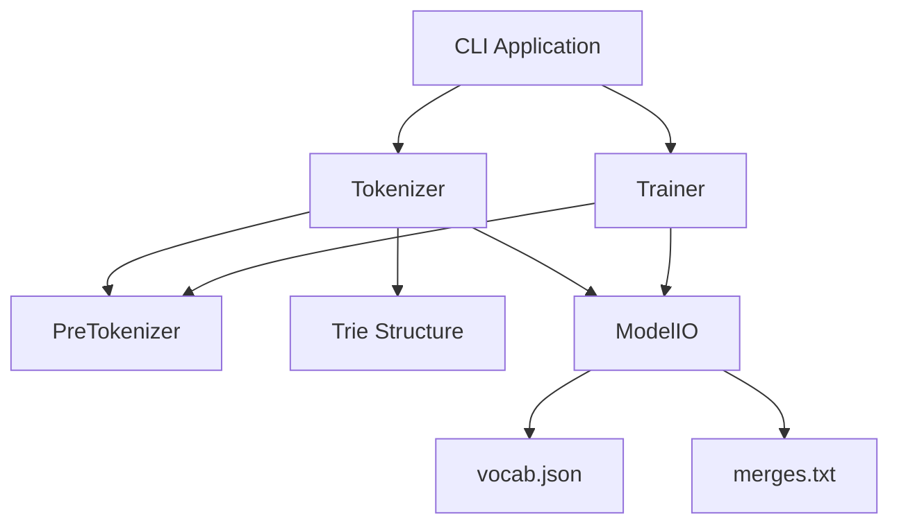
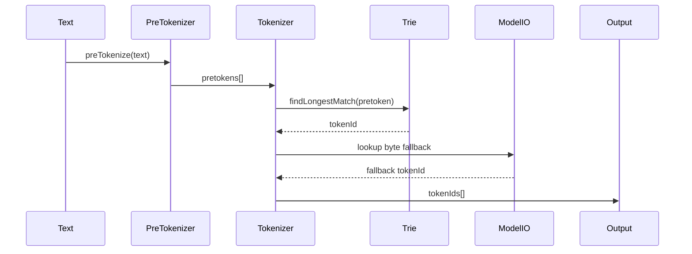
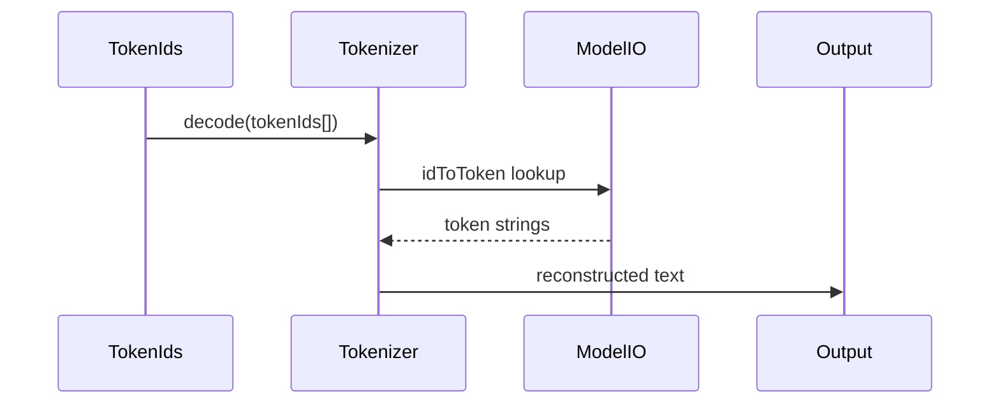
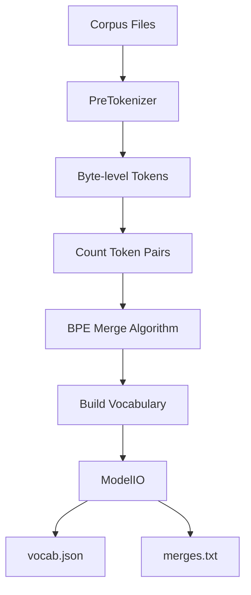
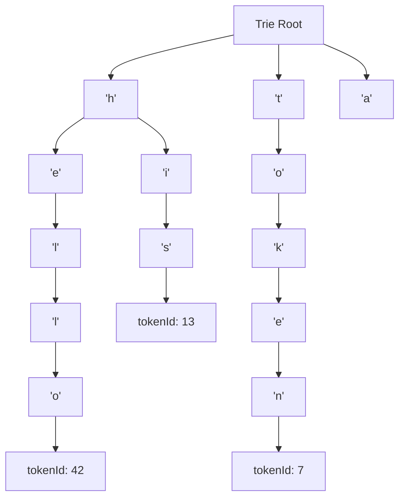
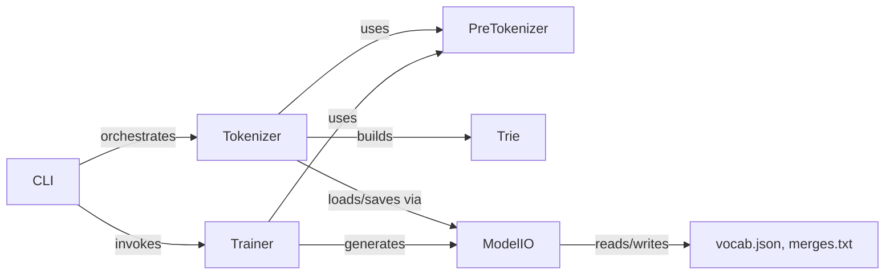

# Architecture

## System Components

```mermaid
graph TB
    CLI[CLI Application] --> Tokenizer[Tokenizer]
    CLI --> Trainer[Trainer]
    Tokenizer --> PreTokenizer[PreTokenizer]
    Tokenizer --> Trie[Trie Structure]
    Tokenizer --> ModelIO[ModelIO]
    Trainer --> PreTokenizer
    Trainer --> ModelIO
    ModelIO --> VocabFile[vocab.json]
    ModelIO --> MergesFile[merges.txt]
```

## Encoding Flow

```mermaid
sequenceDiagram
    participant Text
    participant PreTokenizer
    participant Tokenizer
    participant Trie
    participant ModelIO
    participant Output

    Text->>PreTokenizer: preTokenize(text)
    PreTokenizer->>Tokenizer: pretokens[]
    Tokenizer->>Trie: findLongestMatch(pretoken)
    Trie-->>Tokenizer: tokenId
    Tokenizer->>ModelIO: lookup byte fallback
    ModelIO-->>Tokenizer: fallback tokenId
    Tokenizer->>Output: tokenIds[]
```

## Decoding Flow

```mermaid
sequenceDiagram
    participant TokenIds
    participant Tokenizer
    participant ModelIO
    participant Output

    TokenIds->>Tokenizer: decode(tokenIds[])
    Tokenizer->>ModelIO: idToToken lookup
    ModelIO-->>Tokenizer: token strings
    Tokenizer->>Output: reconstructed text
```

## Training Flow

```mermaid
flowchart TD
    Corpus[Corpus Files] --> PreTokenizer
    PreTokenizer --> ByteTokens[Byte-level Tokens]
    ByteTokens --> PairCounts[Count Token Pairs]
    PairCounts --> BPE[BPE Merge Algorithm]
    BPE --> Vocab[Build Vocabulary]
    Vocab --> ModelIO
    ModelIO --> SaveVocab[vocab.json]
    ModelIO --> SaveMerges[merges.txt]
```

## Trie Structure

```mermaid
graph TD
    Root[Trie Root] --> B1["'h'"]
    Root --> B2["'t'"]
    Root --> B3["'a'"]
    B1 --> H1["'e'"]
    B1 --> H2["'i'"]
    H1 --> E1["'l'"]
    E1 --> L1["'l'"]
    L1 --> L2["'o'"]
    L2 --> TokenID1["tokenId: 42"]
    H2 --> I1["'s'"]
    I1 --> TokenID2["tokenId: 13"]
    B2 --> T1["'o'"]
    T1 --> O1["'k'"]
    O1 --> K1["'e'"]
    K1 --> E2["'n'"]
    E2 --> TokenID3["tokenId: 7"]
```

## Component Dependencies

```mermaid
graph LR
    Tokenizer -->|uses| PreTokenizer
    Tokenizer -->|builds| Trie
    Tokenizer -->|loads/saves via| ModelIO
    Trainer -->|uses| PreTokenizer
    Trainer -->|generates| ModelIO
    ModelIO -->|reads/writes| Files[vocab.json, merges.txt]
    CLI -->|orchestrates| Tokenizer
    CLI -->|invokes| Trainer
```

